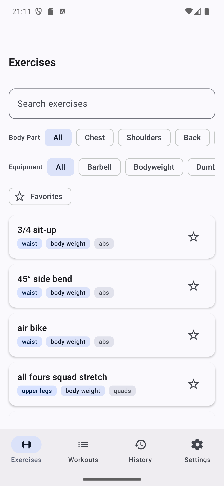
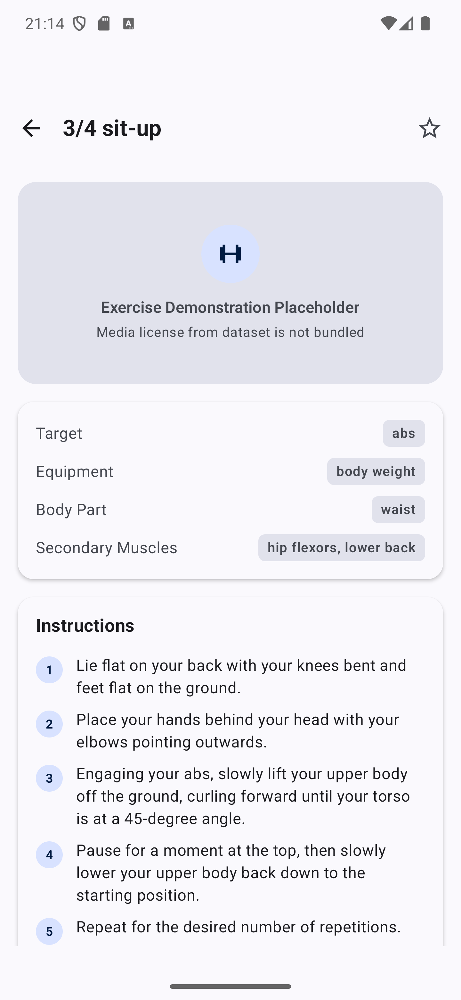
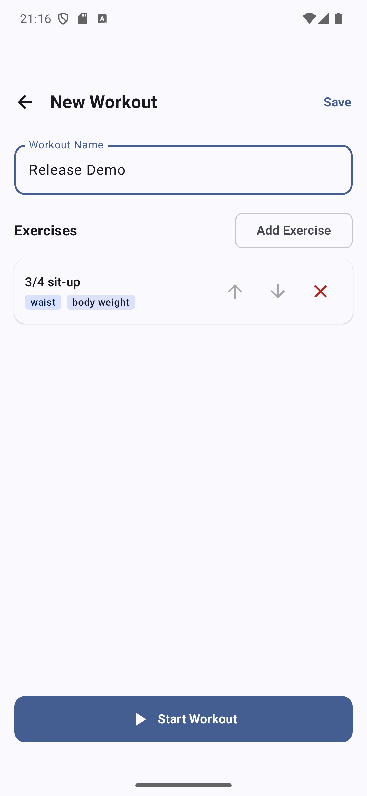
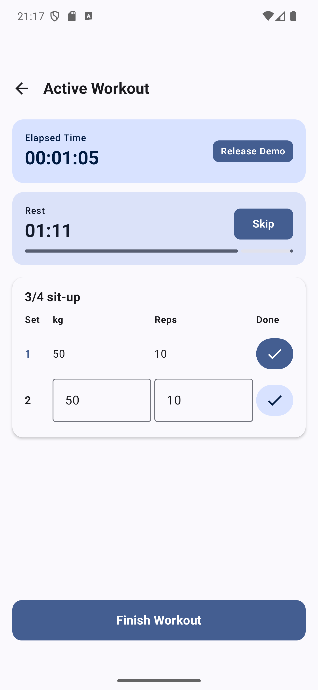
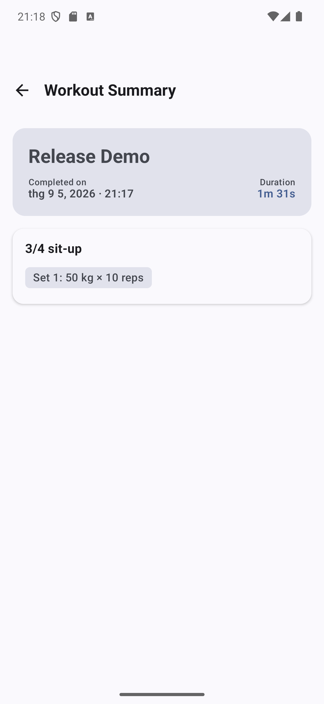

# FitTrack

FitTrack is an educational, offline-first Android workout tracker built with Kotlin and Jetpack Compose. It lets users explore 1,324 exercises, build reusable workouts, record sets/reps/weight, use a rest timer, and review persistent workout history without a backend or account.

## Screenshots

| Exercise library | Exercise detail | Workout editor |
|---|---|---|
|  |  |  |

| Active workout | Workout history detail |
|---|---|
|  |  |

## Features

- Browse, search, and combine body-part/equipment filters across an offline exercise library.
- View exercise targets, secondary muscles, equipment, and step-by-step instructions.
- Favorite exercises.
- Create, rename, reorder, and delete workout templates.
- Enforce workout name, exercise-list, reps, and weight validation.
- Keep only one active workout session and resume it after navigation/recreation.
- Record completed sets immediately in Room.
- Track elapsed time and a 90-second in-app rest timer.
- Finish workouts into persistent history with snapshot data.
- Show total workouts, completed sets, and training time.
- Persist System/Light/Dark theme selection with DataStore.

## Architecture

FitTrack uses a single `:app` module with MVVM, unidirectional data flow, and Clean Architecture Lite:

```text
Compose UI → ViewModel → UseCase/Repository → DAO → Room
```

Room is the single source of truth after first-run seed import. Hilt provides the database, DAOs, repositories, use cases, and ViewModels. UI state is exposed as immutable `StateFlow` and collected lifecycle-aware.

See [the architecture document](docs/ARCHITECTURE.md) for diagrams, layer responsibilities, data flow, lifecycle rules, and the critical workout sequence.

## Tech stack

- Kotlin 2.3.20 and Java 17 toolchain
- Jetpack Compose with Material 3
- Android Gradle Plugin 9.0.1
- Room 2.6.1
- Hilt 2.59.2
- Navigation Compose
- Preferences DataStore
- Kotlin Coroutines, Flow, and StateFlow
- JUnit, kotlinx-coroutines-test, Room Test, and Compose UI Test

Android configuration:

- Minimum SDK: 24
- Target/compile SDK: 36
- Application ID: `com.haitranduc.fittrack`
- Version: `1.0.0` (`versionCode=1`)

## Getting started

### Prerequisites

- Android Studio with its bundled JDK 17, or another JDK 17 installation
- Android SDK Platform 36 and matching build tools
- An Android device/emulator running API 24 or newer

### Build and run

Clone the repository, then run commands from this `FitTrack/` directory:

```powershell
.\gradlew.bat :app:assembleDebug
```

Install `app/build/outputs/apk/debug/app-debug.apk` with Android Studio, ADB, or another Android deployment tool. No API key, account, server, or separate dataset download is required.

### Release build

```powershell
.\gradlew.bat :app:assembleRelease
```

The output is `app/build/outputs/apk/release/app-release-unsigned.apk`. It is intentionally unsigned and must be signed before normal distribution.

## Testing

Run the dataset preprocessing tests:

```powershell
python -m unittest discover -s tools -p "test_*.py" -v
```

Run JVM tests and lint:

```powershell
.\gradlew.bat :app:testDebugUnitTest :app:lintDebug --no-daemon
```

With a device or emulator connected, run instrumentation tests:

```powershell
.\gradlew.bat :app:connectedDebugAndroidTest --no-daemon
```

The coverage strategy prioritizes business rules, Room relationships, ViewModel state, lifecycle restoration, and the critical create → start → complete set → finish → history flow. See [M6 test coverage](docs/testing/M6_TEST_COVERAGE.md).

## Project structure

```text
app/src/main/java/com/haitranduc/fittrack/
├── core/           # Database, navigation, design system, utilities
├── data/           # Room, seed import, mappers, repository implementations
├── domain/         # Models, validation, repository contracts, use cases
└── presentation/   # Compose screens, UI state, ViewModels

app/src/test/       # JVM unit and ViewModel tests
app/src/androidTest # Room integration and Compose UI tests
tools/              # Deterministic exercise-seed preprocessing
docs/               # Architecture, limitations, screenshots, release evidence
```

## Exercise data and attribution

The packaged seed contains 1,324 exercise records derived from [hasaneyldrm/exercises-dataset](https://github.com/hasaneyldrm/exercises-dataset). FitTrack uses MIT-covered metadata and English instruction text only. The upstream Gym visual thumbnails/GIFs are not bundled.

See [Third-Party Notices](THIRD_PARTY_NOTICES.md) for the license notice, transformation details, and media exclusion.

## Known limitations

FitTrack v1.0.0 is local-only, English-only, kilogram-only, and has no account, sync, export/import, notification-based timer, or bundled exercise media. The generated release APK is unsigned.

See [Known Limitations](docs/KNOWN_LIMITATIONS.md) for the complete list.

## Project intent

This project was created for learning and portfolio practice with modern native Android development. It is not a medical, coaching, or production distribution service.
