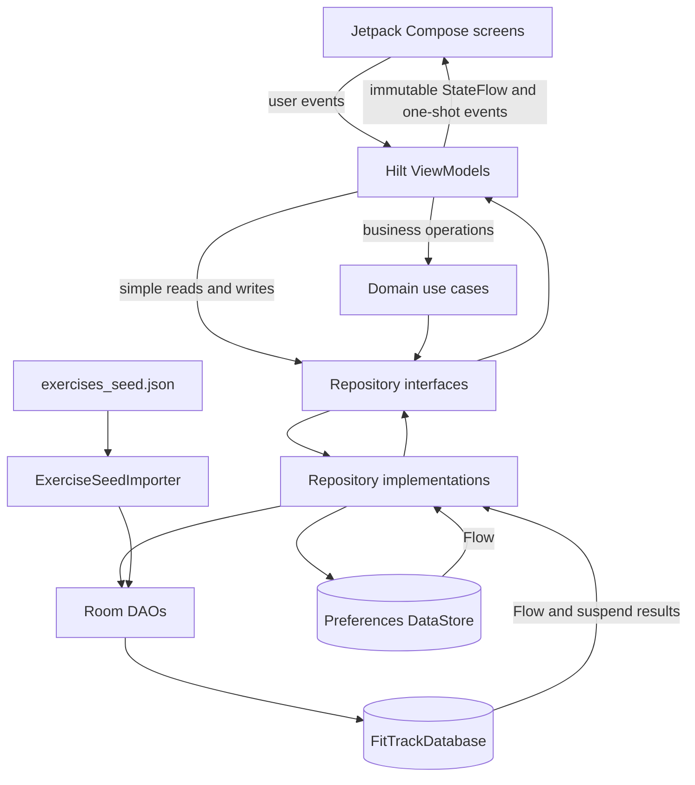
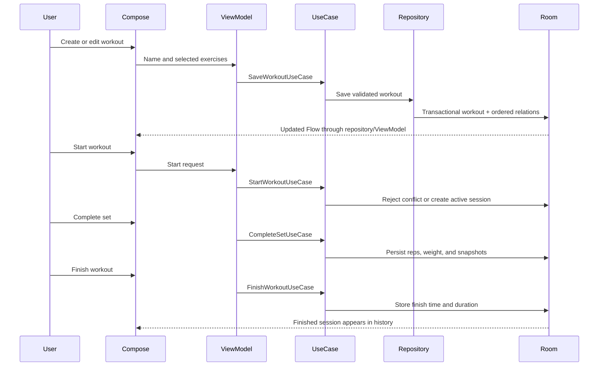

# FitTrack Architecture

FitTrack is a single-module Android application using MVVM, unidirectional data flow, and a small domain layer. It is fully offline: Room is the source of truth for exercises, workouts, sessions, set logs, favorites, and statistics; DataStore stores the theme preference.

## Component map



## Layers

### Presentation

`com.haitranduc.fittrack.presentation` contains Compose screens, immutable UI-state models, and ViewModels:

- `FitTrackViewModel` controls first-run seed initialization.
- `ExerciseListViewModel` and `ExerciseDetailViewModel` expose the exercise library, filters, and favorites.
- `WorkoutListViewModel` and `WorkoutEditorViewModel` manage workout templates and editor drafts.
- `ActiveWorkoutViewModel` owns set input, validation, elapsed time, rest-timer deadlines, and session completion.
- `HistoryViewModel` and `HistoryDetailViewModel` expose finished sessions and statistics.
- `SettingsViewModel` and `ThemeViewModel` coordinate persisted theme selection.

Screens collect state with `collectAsStateWithLifecycle()`. Business validation and database operations do not run inside Composables.

### Domain

`com.haitranduc.fittrack.domain` contains models, repository contracts, validation, and meaningful business operations:

- `SaveWorkoutUseCase`
- `StartWorkoutUseCase`
- `CompleteSetUseCase`
- `FinishWorkoutUseCase`

These use cases enforce workout/session rules and return explicit result types instead of leaking Room entities or database exceptions into the UI.

### Data

`com.haitranduc.fittrack.data` contains Room entities, relations, DAOs, mappers, repository implementations, seed import, and DataStore access.

The principal repository implementations are:

- `ExerciseRepositoryImpl`
- `FavoriteExerciseRepositoryImpl`
- `WorkoutRepositoryImpl`
- `WorkoutHistoryRepositoryImpl`
- `StatisticsRepositoryImpl`
- `ThemePreferenceRepositoryImpl`

Hilt modules bind these implementations to domain interfaces and provide `FitTrackDatabase`, DAOs, and preferences.

## Critical workout flow



## Persistence and integrity

- The 1,324-record English exercise seed is imported once and queried from Room afterward.
- Workout-to-exercise order is stored in a junction table.
- Only one unfinished workout session is allowed by business logic and tested concurrency behavior.
- Completed sessions and set logs keep name snapshots, so deleting a workout template does not erase its history.
- Room schema migrations are explicit; destructive migration is not used.
- Theme selection is persisted separately in Preferences DataStore.

## Lifecycle and concurrency

- ViewModels expose immutable `StateFlow` and use `viewModelScope`.
- Editor input, Active Workout input, filter selections, and rest-timer deadlines use `SavedStateHandle` where recreation matters.
- The UI timer is lifecycle-aware and calls finite `onTimerTick()` updates; tests do not advance an unbounded periodic coroutine.
- Room performs database work off the main thread and emits updates through Flow.

## Navigation

`FitTrackNavHost` owns top-level navigation and navigation results:

```text
Exercises -> Exercise detail
Workouts  -> Create/Edit workout -> Active workout
History   -> History detail
Settings
```

The saved-workout result is consumed once by the navigation destination and forwarded to `WorkoutListViewModel` as a one-shot UI event.
